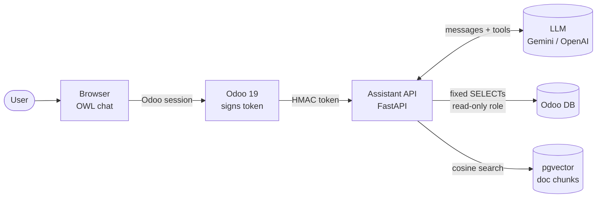

<p align="center">
  
</p>

<p align="center">
  <a href="https://github.com/MSasuR/odoo-ai-assistant">
    
  </a>
</p>

<p align="center">
  <a href="https://www.linkedin.com/in/felipeguerrerov/"></a>
  <a href="mailto:lf.guerrero.vertiz@gmail.com"></a>
  
</p>

---

## 👋 About me

```python
class LuisFelipe:
    role       = "AI Engineer · Cloud Engineer"
    location   = "Lima, Perú 🇵🇪"
    experience = "10+ years building production backends"
    focus      = ["LLMs & RAG", "AI agents with tool calling", "Google Cloud", "Odoo ERP"]
    certified  = ["GCP Professional Cloud Developer", "GCP Associate Cloud Engineer"]
    languages  = {"Spanish": "native", "English": "C1"}
```

## 📈 Impact in numbers

<table align="center">
  <tr>
    <td align="center" width="25%"><h2>450</h2><sub>employees using the<br><b>RAG AI assistant</b> I built</sub></td>
    <td align="center" width="25%"><h2>−90%</h2><sub>HR queries<br>(−55% sales queries)</sub></td>
    <td align="center" width="25%"><h2>1h → 2m</h2><sub>deployment time with<br><b>PR-based CI/CD</b></sub></td>
    <td align="center" width="25%"><h2>−50%</h2><sub><b>GCP costs</b> across<br>multiple projects</sub></td>
  </tr>
</table>

## 🚀 Featured project — [Odoo AI Assistant](https://github.com/MSasuR/odoo-ai-assistant)

<table>
  <tr>
    <td width="58%" valign="top">

A chat assistant embedded in **Odoo 19** that answers questions about **leave, sales and invoices** from live ERP data, and about **company procedures** from a document index — acting strictly as the logged-in user.

- 🧠 **Tool-calling agent**, provider-agnostic (Gemini & OpenAI behind one interface)
- 📚 **RAG on pgvector** with cited sources and a calibrated *"I don't know"*
- 🔐 **Security by design**: HMAC-signed identity, fixed SQL on read-only views, no text-to-SQL
- 🧪 **Measured quality**: retrieval + end-to-end agent evals with ground truth
- ⚙️ **CI** with lint, tests and security checks · non-root container

<p>
  
  
  
  
  
  
</p>

<a href="https://github.com/MSasuR/odoo-ai-assistant"><b>→ Explore the repository</b></a>

</td>
    <td width="42%" align="center" valign="top">
      
    </td>
  </tr>
</table>

<details>
<summary><b>🏗️ Architecture</b> (click to expand)</summary>



**The model proposes, the code disposes:** the LLM picks tools and arguments; identity, permissions and SQL are decided by code.

</details>

## 🛠️ Tech stack

<p align="center">
  
</p>

<p align="center">
  
  
  
  
  
  
  
  
  
  
</p>

## 💼 Experience

| Period | Role | Company | Highlights |
|:--|:--|:--|:--|
| **2021 – now** | Backend Developer · AI & Cloud | **Apiux Tecnología** 🇨🇱 | RAG AI assistant for 450 employees · CI/CD · −50% GCP costs · 5 GCP projects secured · 10k-tx peak platform for public sector |
| 2020 – 2021 | Programmer Analyst | CONASTEC 🇵🇪 | 30+ Odoo 13 modules for 5+ clients · Docker production deployments |
| 2019 – 2020 | Programmer Analyst | JET PERÚ 🇵🇪 | 10+ Odoo modules: billing, accounting, HR, web services |
| 2016 – 2018 | Development Assistant | IPSOS 🇵🇪 | .NET / PHP apps · SQL Server & MySQL · Power BI reports |

## 🏅 Certifications

<p align="center">
  
  
  <br>
  
  
</p>

🎓 **B.Sc. Systems Engineering** — Universidad Peruana de Ciencias Aplicadas (UPC)

---

<p align="center">
  <i>Open to conversations about AI engineering, LLM applications and cloud architecture.</i><br><br>
  <a href="https://www.linkedin.com/in/felipeguerrerov/"></a>
</p>


